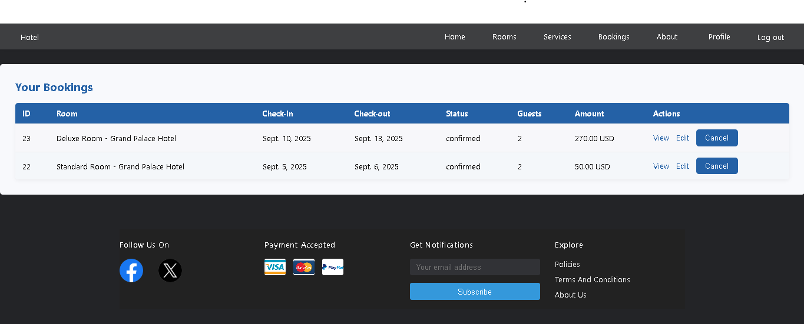

# 🏨 Hotel Management System

  
  
  
  

---

## 📝 Project Description

The **Hotel Management System (HMS)** is a full-stack web application designed to simplify hotel operations.  
It allows staff to manage hotel profiles, rooms, reservations, and customer interactions efficiently.  

Key aspects of the project:

- **Frontend:** Django templates for dynamic, responsive web pages.  
- **Backend:** Django framework with PostgreSQL database.  
- **Database:** PostgreSQL for structured storage of hotels, rooms, and user data.  
- **Authentication & Authorization:** Role-based login for admins and users.  
- **CRUD Operations:** Full management of rooms, reservations, and user profiles.  
- **Deployment:** Hosted on **Heroku** for public access.  
- **Planning:** ERD, user stories, and wireframes designed prior to development.

---

## 🚀 Getting Started

### 🌐 Live Demo
- **Check it here:** [HMS Live App](https://soluna-hotel-7a19d46ffefe.herokuapp.com/)  

### 📋 Planning Materials
- ERD, wireframes, and user stories are available upon request.

### 🗄️ Repository
- [Hotel Management System Repository](https://github.com/Hesham243/Hotel-Management-System)

### How to Use
1. **Sign up** as a new user or **sign in** if you have an account.  
2. Browse available rooms.  
3. **Admins** can create, update, or delete profiles and rooms.    
4. Users can book rooms and view their booking history, download their booking as a PDF.  

---

## ✨ Features

- **User authentication** with role-based access (Admin, Staff, User).   
- **Room management:** Create, update, and remove rooms with descriptions, prices, and availability.  
- **Reservation system:** Users can book rooms and view their bookings.  
- **Responsive design:** Works on desktop and mobile devices.  
- Planned features: payment integration, advanced search/filtering.

---

## 🖼️ Screenshots

### Home Page

### Room Listing Page

### Room Details Page

### Bookings Page

### Booking Details Page

### User Profile Page

### Services Page

*These visuals highlight hotel browsing, room details, and booking management.*

---

## 💡 Technologies Used

- **Frontend:** Django Templates, HTML, CSS, JavaScript  
- **Backend:** Django, Python  
- **Database:** PostgreSQL  
- **Deployment:** Heroku  

---

## 📚 Attributions

- [Bootstrap](https://getbootstrap.com/) for styling  
- [Font Awesome](https://fontawesome.com/) for icons  

---

## 🚧 Next Steps

- Add payment integration for bookings  
- Enable search and filtering of hotels and rooms  
- Implement email notifications for booking confirmations  

---

## 👥 Contributors

| Name          | Role                        | GitHub Profile                                    |
|---------------|-----------------------------|-------------------------------------------------- |
| Hesham Ahmed  | Full Stack Developer / Lead | [Hesham243](https://github.com/Hesham243)         |
| Haider Marhoon| Full Stack Developer / Lead | [HaiderGH](https://github.com/HaiderMarhoon)      |
| Khaled BuJamal| Full Stack Developer        | [KhaledJamal](https://github.com/k7dbh)           |
